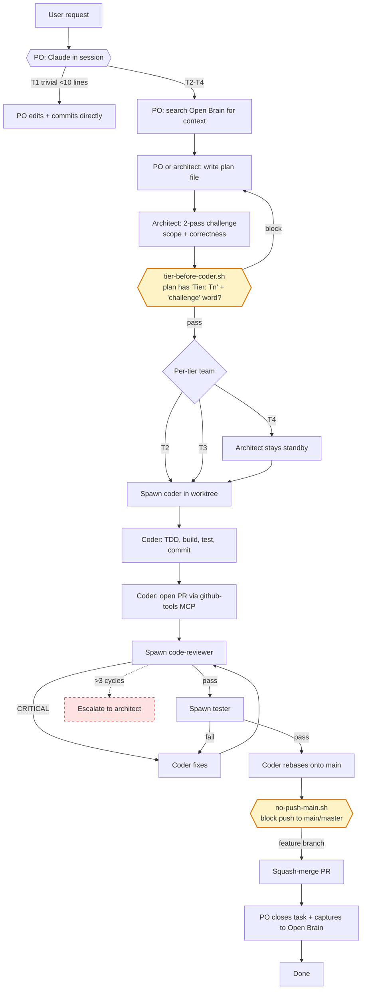

[Back to README](../README.md)

# Workflow Audit

Snapshot of the claude-code-toolkit agent workflow as of 2026-04-12: the current shape (diagram), known weaknesses (W1-W17), and the follow-up PR roadmap derived from those weaknesses.

This document is intentionally not template-specific. It describes the workflow that ships in every variant (general, dotnet, dotnet-maui, rust-tauri, java, python) because the pipeline, hooks, and agents are identical across variants — only the language-specific conventions differ.

## Current workflow diagram

**Legend**

- **Yellow boxes (H1, H2)** — hook-enforced gates. The AI cannot bypass these without the hook firing.
- **Red dashed** — documented in AGENT_TEAM.md but not hook-enforced. The AI can silently skip these and nothing catches it.
- **Per-tier team** — T1 skips the whole pipeline; T2 uses a single coder; T3 adds code-reviewer + tester; T4 keeps architect on standby throughout.

## Weaknesses inventory

Seventeen weaknesses identified during the audit, grouped into five buckets. The ID prefix (W1-W17) is the stable reference used in the follow-up PR roadmap below.

### Hook / enforcement gaps (workflow bypassable)

- **W1. Tier hook is permissive** — `hooks/tier-before-coder.sh` greps for the word `challenge` and `Tier: Tn` but does not verify that *two* challenge passes happened, does not verify the plan corresponds to the current task, and does not validate that tier matches task scope. A stale plan file with the right keywords passes.
- **W2. No team-config-matches-tier guard** — The AI can spawn `coder` alone for a T3 task (missing reviewer + tester) and no hook complains. The Agent PreToolUse hook fires per-spawn and can only enforce negative rules ("don't spawn reviewer for T1"), not positive ones ("must have spawned reviewer by now for T3").
- **W3. No 3-fix-cycle escalation guard** — Rule 8 caps code-review fix cycles at 3 before escalation, but nothing tracks cycle count. The AI can loop indefinitely.
- **W4. No concurrent-merge guard** — Parallel workstreams must merge sequentially (first-ready-first-merge), but nothing prevents two squash-merges firing near-simultaneously.
- **W5. Open Brain session-start search not enforced** — CLAUDE.md tells PO to search Open Brain at session start and before each spawn, but no SessionStart hook fires the search. Hooks are shell commands and cannot invoke MCP tools.
- **W6. Acceptance-criteria verification not enforced** — Tester is told to verify each AC, but nothing gates "mark complete" on actual AC coverage.
- **W7. Test coverage threshold not enforced** — T3 requires ≥ 80% coverage per the Mode Behavior Table, but no hook or MCP reads coverage.

### Documentation inconsistency gaps

- **W8. Escalation Protocol missing from CLAUDE.md TL;DR** — Rule 8 and the Escalation Protocol live in AGENT_TEAM.md only. PO might never escalate if they skim only CLAUDE.md.
- **W9. Merge ownership missing from CLAUDE.md** — "Developer owns the merge" (Rule 5) is in AGENT_TEAM.md; CLAUDE.md silent. Risk: PO merges on coder's behalf.
- **W10. Architect lifecycle ambiguous at T4** — Plan Challenge Protocol says architect shuts down after challenge, but T4 says architect stays on standby. The SubagentStop hook fires uniformly regardless of tier.

### Agent / role gaps

- **W11. No CI/format-recovery role** — Format gates (`dotnet format --verify-no-changes`, `ruff check`, `cargo fmt --check`) can fail at commit time; no agent owns recovery. Coder handles ad-hoc.
- **W12. Tester tool permissions not scoped** — Tester has `Write` / `Edit`, intended for test files only, but nothing prevents writes to `src/`. Relies on agent discipline.

### MCP / tooling gaps

- **W13. No test-execution MCP** — Tests run via `Bash` with commands from `PROJECT_CONTEXT.md`. Works, but results are raw stdout, not structured.
- **W14. No CI-status MCP integration** — `gh_workflow_list` reads workflow status but there is no tool to *wait* for a CI run or *trigger* one. Coder polls manually.

### Skills / agents overlap

- **W15. Architect already "challenges" plans; `writing-plans` skill also produces plans** — The Spawn-Prompt Binding Table assigns `writing-plans` to architect. In practice, the architect in AGENT_TEAM.md mostly *challenges* plans that the PO wrote, rather than writing them from scratch. The skill assignment is correct for the plan-authoring case, but challenge (done by architect) and authoring (often done by PO or requirements-engineer) are distinct jobs.
- **W16. `receiving-code-review` assigned to coder, but coder agent file has no current reference to review-handling discipline** — The Spawn-Prompt Binding Table is the first wiring. No redundancy, but also no pre-existing safety net if a spawn prompt is miswritten.
- **W17. `brainstorming` assigned to both architect and requirements-engineer** — The only genuine skill duplication in the binding table. Both roles legitimately use brainstorming (architect for design exploration, requirements-engineer for spec ideation). Probably fine, but flagged for awareness.

## Follow-up PR roadmap

The skills-wiring PR (see [`plans/2026-04-12-wire-superpowers-skills.md`](plans/2026-04-12-wire-superpowers-skills.md)) is the first step. The remaining weaknesses split into three follow-up PR themes plus a deferred bucket.

### Follow-up PR A — Documentation consistency

**Items:** W8, W9, W10, W12
**Scope:** Pure text edits across `templates/*/CLAUDE.md` and `templates/*/AGENT_TEAM.md`.

- W8: Add Escalation Protocol bullet to CLAUDE.md TL;DR in every variant.
- W9: Add "Developer owns the merge" bullet to CLAUDE.md TL;DR.
- W10: Clarify T4 architect lifecycle in AGENT_TEAM.md (architect stays on standby for T4; shuts down after challenge for T2-T3).
- W12: Add a note to the `tester.md` agent file (or to the tester section of AGENT_TEAM.md) reminding that `Write` / `Edit` access is intended for test files only.

**Estimated scope:** ~12-14 file edits, no hook changes, no new infrastructure.

### Follow-up PR B — Hook hardening

**Items:** W1, W2 (partial)
**Scope:** `hooks/tier-before-coder.sh` logic changes + new test cases.

- W1: Tighten the regex to require both `Challenge 1` and `Challenge 2` literals (or an explicit two-pass marker). Add a plan-freshness check — either by checking the plan file's `mtime` against some threshold, or by verifying the plan path is referenced in recent conversation context.
- W2: Validate the spawn request's agent type against an inferred tier from the plan file. Can enforce negative rules only (e.g., reject spawning `code-reviewer` for a T1 plan). Cannot enforce positive rules (e.g., "must have spawned reviewer by now") because hooks are stateless across invocations.

**Estimated scope:** 1 shell script + test fixtures + docs update. Requires its own design round before implementation because the plan-freshness heuristic is non-trivial.

### Follow-up PR C — MCP expansion

**Items:** W13, W14
**Scope:** New tools in the `mcp-dev-servers` repo (not this repo).

- W13: Test-execution MCP that wraps `PROJECT_CONTEXT.md`'s `TEST_COMMAND` and returns structured results (pass/fail counts, failing test names, stdout on failure only).
- W14: CI-wait MCP that polls `gh_workflow_list` and blocks until a specific workflow run finishes, returning success/failure and log excerpts.

**Estimated scope:** Two new Python MCP servers in `mcp-dev-servers/src/`, plus HOWTO.md registration docs in this repo. Multi-session work.

### Deferred / infeasible in current hook architecture

- **W3 (3-fix-cycle counter)** — requires session-state tracking that the PreToolUse hook cannot carry across invocations.
- **W4 (concurrent-merge guard)** — merges happen through github.com, not local git; no local hook point.
- **W5 (Open Brain session-start hook)** — hooks are shell commands, cannot invoke MCP tools. Would need a new mechanism (e.g., a SessionStart prompt injection rather than a hook).
- **W6 (AC verification)** — requires parsing per-task ACs and matching to tester output. Custom logic per task; no generic solution.
- **W7 (coverage threshold)** — needs a per-language coverage parser. Each variant differs.
- **W11 (CI/format-recovery agent)** — new agent role needing its own scope negotiation against coder's responsibilities.

These are captured as Open Brain thoughts during the skills-wiring PR so they are discoverable in future sessions, but none of them have a feasible implementation path within the current hook + agent architecture.

## Source

This audit was produced during a plan-mode session on 2026-04-12 by a subagent exploration of the `general` template variant (`templates/general/AGENT_TEAM.md`, `templates/general/.claude/agents/*.md`, `hooks/*.sh`, `templates/general/.claude/settings.json`, `templates/general/CLAUDE.md`). The findings generalize across all six variants because the workflow pipeline, hooks, and agent definitions are identical; only language-specific conventions differ.
